# career-agent

A career operating system for Claude Code. 15 skills and 7 subagents that write resumes, cover letters, cold messages, interview prep, and outreach from an evidence bank built out of your real work, then attack every draft with adversarial reviewers before you ever see it.

Covers job search, grad school and research outreach, and freelance client pitching.

It also runs itself. A daily launchd job sweeps 160+ applicant tracking system boards, screens what it finds, builds the resume, writes the fit analysis and the cover letter, fills the form in a real browser and stops at the Submit button. The section below is the whole pipeline; [docs/architecture.md](docs/architecture.md) is the longer version.

---

## The problem this solves

Ask any LLM to rewrite your resume and you get a fluent document containing metrics you never earned, in a voice that is not yours, that you cannot defend in an interview. It reads well and it is unusable, and you will not find out which parts were invented until someone asks you about them.

career-agent fixes that with four structural choices.

### 1. The evidence bank

Your career is parsed once into atomic records with stable ids, from your GitHub commit history, your LinkedIn export, and your career documents.

```yaml
- id: EV-014
  action: "Rebuilt the batch inference path from per-row calls to vectorized ONNX"
  metric: {value: 4.2, unit: "x", dimension: "throughput"}
  scope: "12M records/day, 3 person team"
  confidence: verified
  sources: ["github:you/repo", "Resume.pdf p1"]
```

Every resume bullet, cover letter line, cold message, and interview answer is **selected and reframed** from this bank. Nothing is invented. A `fact-checker` agent reads each draft, traces every claim to an id, and blocks the draft on anything unmapped.

An atom with no metric is flagged rather than filled in with a plausible number. You supply the real one once, during intake, and it is reused forever.

### 2. Sources that cannot flatter you

The bank is not built from one resume you wrote from memory. It is built from:

- **GitHub**, through the authenticated `gh` CLI: every repo public and private, language byte counts, commit history with real date spans, and pull requests you opened on other people's projects
- **LinkedIn**, through the official data export: positions, education, endorsements, recommendations, and your full connection graph
- **Your documents**: resumes, cover letters, past applications, statements of purpose, research and coursework

Your connection graph is the highest-value part. Knowing you already have a first-degree connection at a company changes the strategy from cold outreach to a warm introduction, which converts several times better.

### 3. LLM judging with a mechanical floor

An LLM judge scores drafts against an anchored rubric with written examples for every score band, running in a **fresh subagent each pass** so it never sees its own previous score and cannot drift upward across revisions.

Python handles only what is not a judgment call: will an ATS parser choke on this file, is the literal keyword present, does the text contain a banned phrase. The LLM does the actual evaluation, because it is far better at it.

Generation is a loop. Draft, attack, revise, repeat, terminate on a verdict rather than on the model feeling finished.

### 4. Adversarial review

Every outbound document is attacked in parallel before you see it:

| Agent | What it does |
|---|---|
| `recruiter-screener` | Six-second reject scan. Prompted to reject by default. Returns the exact line that lost it. |
| `resume-judge` | Scores against the anchored rubric. Fresh context every pass. Returns literal rewrite lines. |
| `ats-auditor` | Parse safety and keyword coverage. Catches the failures you never find out about. |
| `fact-checker` | Traces every claim to an evidence id. Blocks hallucinations and inflations. |
| `jd-analyst` | Decodes a posting into ranked must-haves and the unstated problem behind the req. |
| `company-researcher` | Finds one specific sourced fact. Refuses to return anything without a URL. |
| `interview-panel` | Hiring manager, peer engineer, and bar raiser, independently. |

---

## Architecture

Six stages. Stage 1 to 4 need no human; stage 5 is where you press Submit.

```mermaid
flowchart TD
    subgraph collect["1 - Collect, no model"]
        A1[watch_simplify.py, discover_data.py, discover_ats.py<br/>160+ ATS boards]
        A2[agent_boards.py<br/>Dice, LinkedIn capped at 2 searches a day]
        A3[liveness_check.py<br/>retire dead postings]
    end
    subgraph screen["2 - Screen before building anything"]
        B1[screen_job.py<br/>sponsorship, clearance, years floor, graduation window]
        B2[form_check.py, prefill.py<br/>read the application form first]
        B3[agent_verdict.py<br/>fit score, blockers, missing keywords]
    end
    subgraph build["3 - Build the page"]
        C1[fast_resume.py<br/>17 verified base variants]
        C2[skills_basis.py<br/>every posting technology you have used]
        C3[agent_keywords.py, agent_bullets.py<br/>evidence-backed edits and selection]
        C4[6 PDF gates<br/>page, line, spacing, chrono, title, tex]
    end
    subgraph judge["4 - Judge and prepare"]
        D1[agent_fit.py<br/>fit analysis, checked]
        D2[agent_cover.py<br/>cover letter, checked]
        D3[agent_answers.py, prefill.py<br/>every form answer in one packet]
    end
    subgraph apply["5 - Apply, you press Submit"]
        E1[apply_next.py<br/>one job at a time]
        E2[autofill.py<br/>fills Greenhouse in Chrome, never submits]
    end
    subgraph after["6 - After it goes out"]
        F1[agent_mail.py<br/>read-only inbox triage]
        F2[agent_recruiters.py<br/>the right recruiter per company]
        F3[build_desk.py<br/>the Application Desk page]
    end
    collect --> screen --> build --> judge --> apply --> after
    after -. replies, follow-ups, new evidence .-> collect
```



### Which model does what, and why

| Job | Runs on | Why |
|---|---|---|
| Discovery, liveness, skills line, packets, exports | Python only | Deterministic. A model adds cost and risk, not accuracy. |
| Posting verdicts | Nemotron Ultra | Picked by a bake-off on postings whose answer was already known: Ultra 13/13, Gemini 3.5 Flash 91%, gpt-oss-20b 73%, Nemotron Super 54%. |
| Fit analysis | Kimi K3, then Nemotron Ultra | Kimi first; when its analysis fails the automated checks, Ultra rewrites it. |
| Bullet selection, form answers, cover letters | Ultra, Kimi K3, DeepSeek V4 Flash, Muse Glimmer | Drafting inside hard constraints, every output checked by script. |
| Boards, inbox triage, recruiter ranking | Nemotron Super, gpt-oss, GLM | Cheap classification over a lot of text. |
| Resume writing for the best postings | Claude Opus | The one step where judgement about a career is worth the cost. |

Rosters live in `data/nim_roster.json`, one ordered list per role. `scripts/nim.py` speaks to NVIDIA NIM,
Google AI Studio and Ollama Cloud through one OpenAI-compatible client, marks a failing model unhealthy
for six hours and logs every call. Keys come from the macOS keychain, never from a file. Gemini is barred
from inbox and recruiter data because its free tier may train on prompts.

### What a hosted model is allowed to see

`scripts/nim_profile.py` builds the only profile that leaves the machine: no contact details, no private
notes, no unverifiable atoms, and any figure that came from a resume rather than a repository is masked as
`[figure withheld]`. A model cannot restate a number nobody has verified.

### The checks that make cheap models usable

Every model output passes a deterministic gate before it reaches a page.

| Output | Rejected when |
|---|---|
| Resume PDF | The page is not full, a bullet ends in a runt line, spacing varies, dates are out of order, a title does not match `titles.yaml`, or the text is not extractable |
| Bullet edit | A number changed, or an added word is neither an English word nor a technology the bank supports |
| Bullet selection | A bullet is not character for character one of the fact-traced pool, or sits under the wrong job |
| Fit analysis | A section is missing, the weighted sub-scores do not reproduce the score, stage probabilities rise, or a quoted line is on neither the resume nor the posting |
| Cover letter | The hook is not grounded in a real posting sentence, a number is on neither the resume nor the posting, a technology is claimed that is not on the resume, or it claims you live in the employer's city |
| Form answer | A number is not from a cited atom, or the answer was truncated |

### Guardrails

- `autofill.py` has no code path that submits. Its only clicks are on dropdown options, and a guard refuses
  anything that looks like a submit, apply or send control.
- The mail agent opens the inbox read-only. No email is ever sent.
- LinkedIn is capped at two job searches and three people searches a day, and never messages or connects.
- A question that cannot be answered honestly is left blank and marked for you.
- A claim you have not confirmed is held in the bank as `needs_confirmation` and kept off every page.

---

## Install

```bash
git clone <your-repo-url> ~/Documents/my-projects/career-agent
cd ~/Documents/my-projects/career-agent
bash install.sh
```

The installer creates a virtualenv, installs dependencies, installs `gh` if homebrew is present, symlinks all 15 skills into `~/.claude/skills/` and all 7 agents into `~/.claude/agents/`, and initializes the pipeline database.

Then authenticate GitHub, which needs a browser and so cannot be automated:

```bash
gh auth login
```

Then, in Claude Code from any directory:

```
/career-setup
```

To include LinkedIn: go to LinkedIn, Settings, Data Privacy, Get a copy of your data, request the full archive, and drop the ZIP into `data/raw/`. Everything works without it; the export adds your endorsement data and your connection graph.

---

## The skills

### The seven core writing skills

| Command | What it does |
|---|---|
| `/resume-rewrite <role> <company-type>` | Evidence selection, vocabulary mirroring, then the four-agent review loop until the screener says INTERVIEW. Emits ATS-safe DOCX and PDF plus a trace mapping every bullet to its evidence id. |
| `/linkedin-profile <role> <industry>` | Derives the boolean strings recruiters actually search, then writes headline, About, and top experience to rank for them. Leads with skills other people endorsed. |
| `/target-app-strategy <title> <industry> <location>` | A 7-day plan naming real open roles pulled live, ordered so warm intros come before cold volume. Writes every day's actions into the pipeline as dated tasks. |
| `/cold-message-manager <company> <role>` | Checks for a warm path first. Then one sourced insight, one evidence-backed bridge, one frictionless ask, under 80 words, three variants, screener picks the winner. |
| `/coverletter <role> <company>` | Hook first, hard 200-word cap. Each paragraph answers a real need from the posting. Bans "I am applying for" and the rest. |
| `/interview-prep <role> <company>` | Eight questions derived from the actual posting, each answer built from a STAR record, stress-tested by three interviewer lenses. Reports which follow-up you cannot currently answer. |
| `/follow-up <type> <name> <company>` | Reads the pipeline history so it never repeats itself. One new piece of value or it tells you not to send. |

### Infrastructure

| Command | What it does |
|---|---|
| `/career-setup` | Builds the evidence bank from all three sources. Interviews you only about the missing numbers. |
| `/career` | Orchestrator. Diagnoses the funnel, routes to the right skill, gives you exactly one next action. |
| `/job-hunt <query>` | Live roles from public ATS APIs, ranked by what your evidence actually proves, with warm paths marked. |
| `/apply <url or id>` | End to end for one role, including the screening-question answer sheet. Stops before submit. |
| `/pipeline` | Status board, conversion funnel, stale applications, follow-ups due. |
| `/fit-analysis <url>` | Weighted assessment of one resume against one posting: ATS, technical, experience and competitiveness, with stage-by-stage interview probability and an apply-or-skip verdict. Scores only what a recruiter can see. |

### Adjacent

| Command | What it does |
|---|---|
| `/sop <program> <professor>` | Statements of purpose and cold research emails grounded in the professor's actual recent papers. |
| `/pitch <client> <service>` | Freelance proposals framed around client outcome and ROI, with scope, price, and risk reduction. |

---

## Style enforcement

`templates/style-rules.md` bans em dashes, curly quotes, icon glyphs, emoji, and roughly seventy phrases that mark text as machine written or that cost a line while saying nothing. `scripts/style_check.py` parses the ban list out of the markdown, so there is one source of truth, and exits non-zero on any violation.

`scripts/render.py` refuses to produce a DOCX from text containing a banned character. The check happens before the document exists, not after it reaches a recruiter.

---

## What it will not do

- **Submit anything.** Every action stops at a draft or a pre-filled form. You submit.
- **Automate LinkedIn.** No scraping, no auto-connecting, no Easy Apply bots. The account matters more than the automation.
- **Invent a metric.** Ever. A gap becomes `[NEED: throughput before and after]` and a question.
- **Obscure work authorization.** Stated plainly wherever it is asked.
- **Read your financial or immigration documents.** The scanner refuses tax, loan, lease, passport, DS-160, and I-20 folders outright.

---

## Layout

```
career-agent/
├── install.sh                 # venv, deps, gh, symlinks, db
├── connectors/                # github.py  linkedin.py  docs.py  build_evidence.py
├── docs/architecture.md       # the pipeline, end to end
├── scripts/
│   ├── pipeline.py            # the SQLite CRM behind everything
│   ├── discover_*.py          # board sweeps, liveness, screening
│   ├── nim.py nim_profile.py  # hosted-model client and the profile it may see
│   ├── agent_*.py             # one agent per task: verdict, fit, bullets, cover,
│   │                          # answers, keywords, boards, recruiters, mail
│   ├── fast_resume.py         # resume builds from verified variants
│   ├── *_check.py             # the six PDF gates plus ats_check and style_check
│   ├── prefill.py autofill.py # form answers, and the filler that never submits
│   ├── apply_next.py          # one job at a time, end to end
│   ├── build_desk.py          # the Application Desk page
│   └── daily_run.sh           # the launchd run
├── skills/                    # 15 skills
├── agents/                    # 7 subagents
├── templates/                 # style-rules.md  rubric-resume.md
├── profile/                   # YOUR DATA, gitignored
│   ├── identity.yaml          # contact, work auth, constraints
│   ├── evidence.yaml          # the evidence bank
│   ├── skills.yaml            # skill -> proficiency -> backing evidence ids
│   ├── voice.md               # your real writing samples
│   └── narrative.md           # positioning and red-flag answers
└── data/                      # gitignored
    ├── raw/                   # collected source data
    ├── pipeline.db            # SQLite CRM
    └── artifacts/             # every generated document
```

`profile/` and `data/` are gitignored, so the repo is publishable without leaking anything personal.

---

## Scripts you can run directly

```bash
python scripts/pipeline.py stats
python scripts/pipeline.py due
python scripts/pipeline.py stale --days 10
python scripts/pipeline.py who Stripe

python scripts/discover.py --query "ml engineer" --location remote
python scripts/ats_check.py --resume resume.pdf --jd posting.txt
python scripts/style_check.py draft.md --max-words 200
python scripts/render.py resume.md -o resume.docx --pdf

python connectors/build_evidence.py stats
python connectors/build_evidence.py gaps
python connectors/docs.py --list-only        # dry run, reads nothing
```

---

## Credit

Inspired by [AkbarDevop/ai-job-agent](https://github.com/AkbarDevop/ai-job-agent), which proved the persona-driven skill approach works. This build takes a different position on two things: evidence traceability over generation fluency, and semi-automated apply over unattended submission.
