# Pipeline architecture

How a job posting becomes an application that is ready to submit, and who does each step.

Two rules shape everything below.

1. **Nothing is submitted automatically.** The form filler stops at the Submit button, and an
   application is recorded as sent only when the user says he pressed it himself.
2. **Nothing is invented.** Every number on a page traces to one atom in the evidence bank, and
   the cheap models never write a claim: they select from text that was written and traced once.

## The flow

```mermaid
flowchart TD
    subgraph collect["1. Collect, no model"]
        A1[watch_simplify.py<br/>SimplifyJobs feed]
        A2[discover_data.py<br/>54 verified ATS boards]
        A3[discover_ats.py<br/>every board seen before, 160+]
        A4[agent_boards.py<br/>Dice MCP, LinkedIn capped at 2 searches]
        A5[liveness_check.py<br/>retire dead postings]
    end
    subgraph screen["2. Screen, rules first"]
        B1[screen_job.py<br/>sponsorship, citizenship, clearance,<br/>years floors, graduation window]
        B2[form_check.py + prefill.py<br/>read the form before building anything]
        B3[agent_verdict.py<br/>fit score and blockers]
    end
    subgraph build["3. Build the page"]
        C1[fast_resume.py<br/>17 verified base variants]
        C2[skills_basis.py<br/>every posting technology he has used]
        C3[agent_keywords.py<br/>evidence-backed bullet edits]
        C4[agent_bullets.py<br/>fit a base to a role by selecting bullets]
        C5[PDF gates<br/>page, line, spacing, chrono, title, tex]
    end
    subgraph judge["4. Judge and prepare"]
        D1[agent_fit.py<br/>fit analysis, checked]
        D2[agent_answers.py<br/>open form answers]
        D3[agent_cover.py<br/>cover letter, checked]
        D4[prefill.py write_packet<br/>every form answer, one file]
    end
    subgraph apply["5. Hand over"]
        E1[the packet, the resume and the letter]
        E2[he applies himself]
    end
    subgraph after["6. After it goes out"]
        F1[agent_mail.py<br/>read-only IMAP triage]
        F2[agent_recruiters.py<br/>the right recruiter per company]
        F3[build_desk.py<br/>the Application Desk page]
    end
    collect --> screen --> build --> judge --> apply --> after
    after -. new evidence, replies, follow-ups .-> collect
```

`daily_run.sh` runs stages 1 and 2 under launchd every morning; stage 1 is pure Python and always
runs, stage 2 is the one Claude Code session that does judgement work the scripts cannot.

## Who runs what

| Job | Runs on | Why |
|---|---|---|
| Discovery, liveness, CSV exports, skills section, packets | Python only | Deterministic. A model would add cost and risk, not accuracy. |
| Posting verdicts (`agent_verdict.py`) | Nemotron Ultra | Chosen by a bake-off against postings whose answer was already known: Ultra 13/13, Gemini 3.5 Flash 91%, gpt-oss-20b 73%, Nemotron Super 54%. |
| Fit analysis (`agent_fit.py`) | Kimi K3, then Nemotron Ultra | Kimi first by preference; when its analysis fails the automated checks, Ultra rewrites it. |
| Bullet fitting, written answers, cover letters | Nemotron Ultra, Kimi K3, DeepSeek V4 Flash, Muse Glimmer | Selection and drafting inside hard constraints, every output checked by script. |
| Job boards, mail triage, recruiter ranking | Nemotron Super, gpt-oss, GLM | Cheap classification over large text. |
| Resume writing for the top postings | Claude Opus | The one step where judgement about a person's career is worth the cost. |

Model rosters live in `data/nim_roster.json`, one ordered list per role, with health marks and
per-role timeouts in `scripts/nim.py`. A model that fails is skipped for six hours. Providers:
NVIDIA NIM, Google AI Studio (Gemini) and Ollama Cloud, all OpenAI-compatible, keys in the macOS
keychain and never in the repo. Gemini is barred from mail and recruiter data, because its free
tier may train on prompts.

## What the models are allowed to see

`nim_profile.py` builds the only profile a hosted model receives: no contact details, no private
notes, no unverifiable atoms, and figures that came from a resume rather than a repo are masked as
`[figure withheld]`, so a model cannot restate a number nobody has verified.

## The checks that make cheap models usable

Every model output passes a deterministic gate before it reaches a page.

- **Resume PDFs**: `page_check` (fills the page, one page), `line_check` (no runt last lines),
  `spacing_check` (one spacing value everywhere), `chrono_check` (reverse chronological),
  `title_check` (titles match `profile/titles.yaml`), `tex_check` (extractable text, no stray markup).
- **Bullet edits** (`agent_keywords.py`): numbers unchanged, every added word either an English
  word or a technology the evidence bank supports, the whole build reverted if a gate fails.
- **Bullet selection** (`agent_bullets.py`): a bullet must match a pooled, fact-traced bullet
  character for character and sit under the job it was written for.
- **Fit analysis** (`agent_fit.py`): every required section present, weighted sub-scores reproduce
  the stated score, stage probabilities never rise, exactly one recommendation, every quoted line
  present on the resume or in the posting.
- **Cover letters** (`agent_cover.py`): the hook must rest on a sentence that is really in the
  posting, every number must appear on the resume or in the posting, a technology may be called his
  only if it is on his resume, banned openers and groveling rejected, 120 to 200 words.
- **Written answers** (`agent_answers.py`): numbers only from cited atoms, no evidence ids in the
  text, truncated answers treated as failures.

## Data

| Path | Holds |
|---|---|
| `profile/evidence.yaml` | The evidence bank: atomic records with ids, metrics, sources, confidence |
| `profile/titles.yaml`, `answers.yaml`, `identity.yaml` | Job titles as held, standing form answers, constraints |
| `data/pipeline.db` | SQLite: applications, artifacts, contacts, tasks, interactions |
| `data/artifacts/<slug>/` | Per application: packet, fit analysis, cover letter, verdict |
| `data/logs/` | Daily run logs, batch state, model usage (`nim-usage.jsonl`) |
| `latex/resume/` | Resume sources; every variant compiles with tectonic |
| `data/desk.html` | The generated Application Desk page |

`profile/`, `data/` and `latex/` are gitignored. This repository publishes the machinery, never the
person's data.

## Guardrails

- Nothing submits and nothing types into an employer's form. The Playwright form filler was retired on
  2026-09-17 with bulk preparation; the pipeline hands over a resume, a letter and an answer sheet.
- No email is ever sent: the mail agent opens the mailbox read-only (`EXAMINE`, `BODY.PEEK`).
- LinkedIn is capped at two job searches and three people searches a day, and never messages or
  connects with anyone.
- Answers that cannot be given honestly (a years-of-experience floor, a cohort question) are left
  blank and marked for the user rather than guessed.
- A claim the user has not confirmed is recorded in the bank as `needs_confirmation` and kept off
  every page until he answers.
